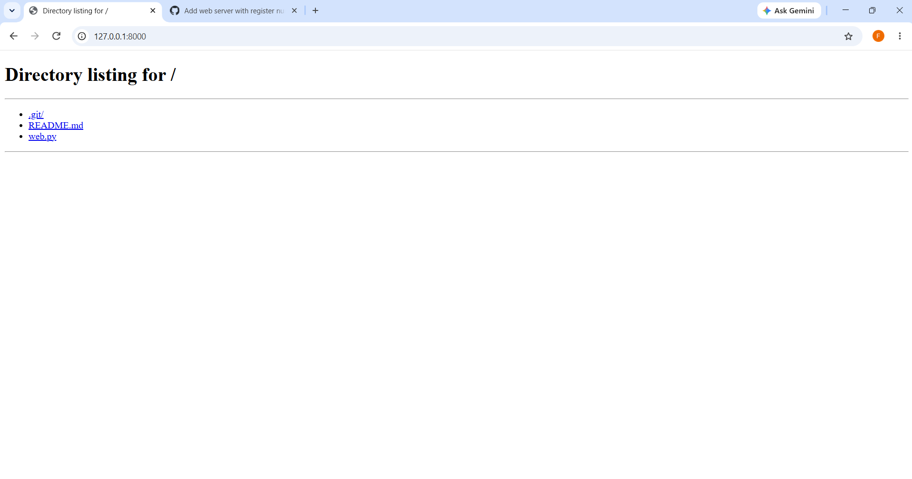
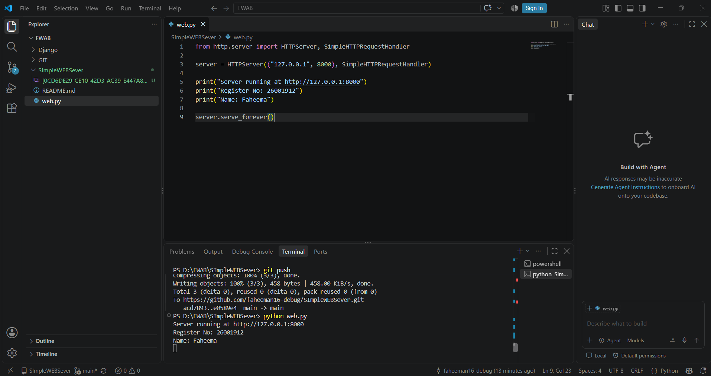

# SImpleWEBSever
# EX01 Developing a Simple Webserver
## Date:29.09.2026

## AIM:
To develop a simple webserver to serve html pages and display the Device Specifications of your Laptop.

## DESIGN STEPS:
### Step 1: 
HTML content creation.

### Step 2:
Design of webserver workflow.

### Step 3:
Implementation using Python code.

### Step 4:
Import the necessary modules.

### Step 5:
Define a custom request handler.

### Step 6:
Start an HTTP server on a specific port.

### Step 7:
Run the Python script to serve web pages.

### Step 8:
Serve the HTML pages.

### Step 9:
Start the server script and check for errors.

### Step 10:
Open a browser and navigate to http://127.0.0.1:8000 (or the assigned port).

## PROGRAM:
from http.server import HTTPServer, SimpleHTTPRequestHandler

server = HTTPServer(("127.0.0.1", 8000), SimpleHTTPRequestHandler)

print("Server running at http://127.0.0.1:8000")
print("Register No: 26001912")
print("Name: Faheema")

server.serve_forever()

## OUTPUT:

## RESULT:
The program for implementing simple webserver is executed successfully.
